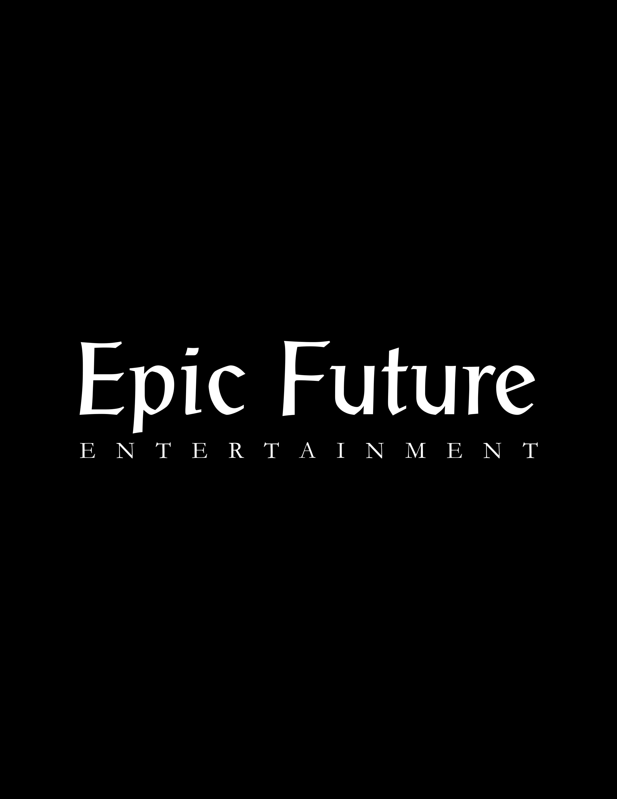
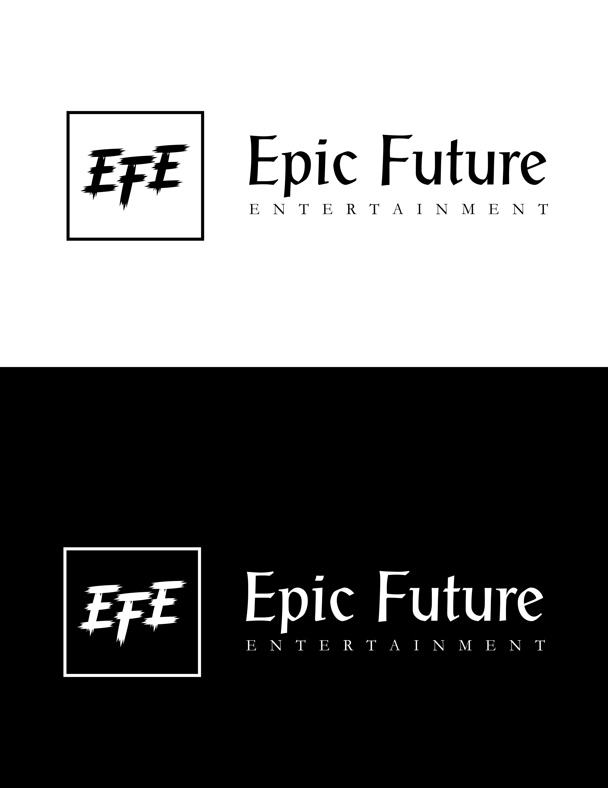
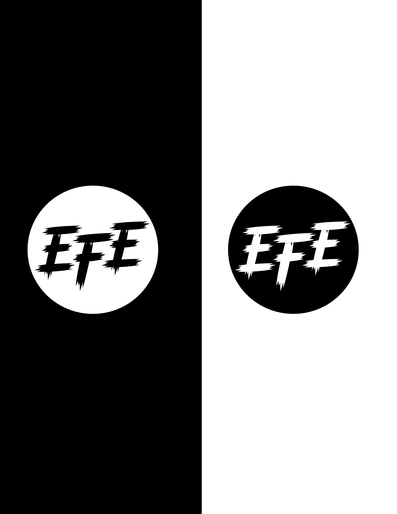
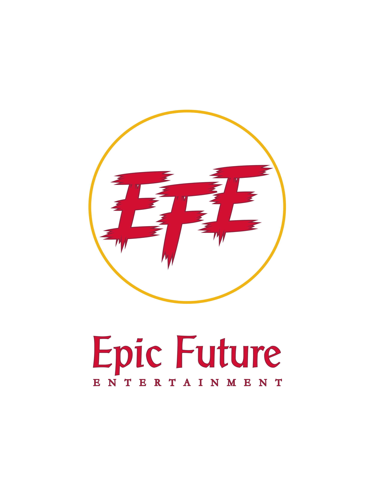
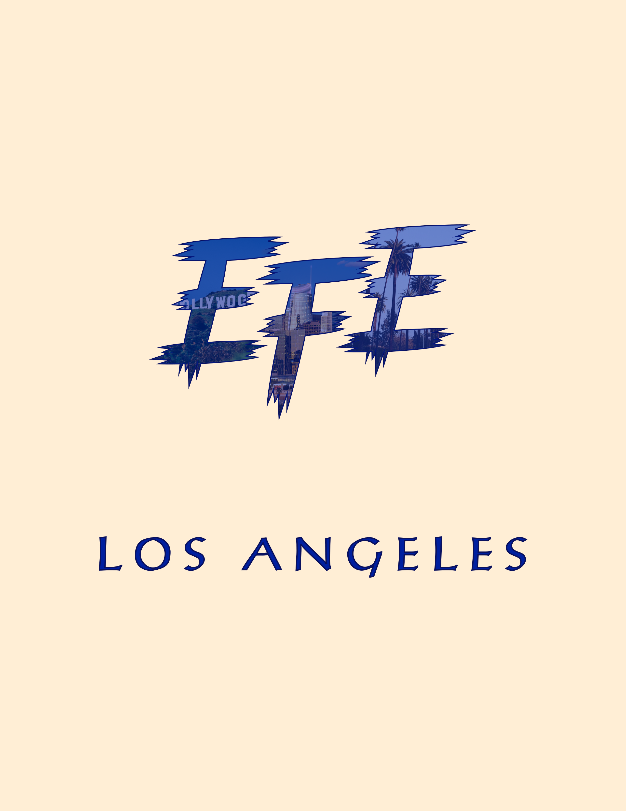
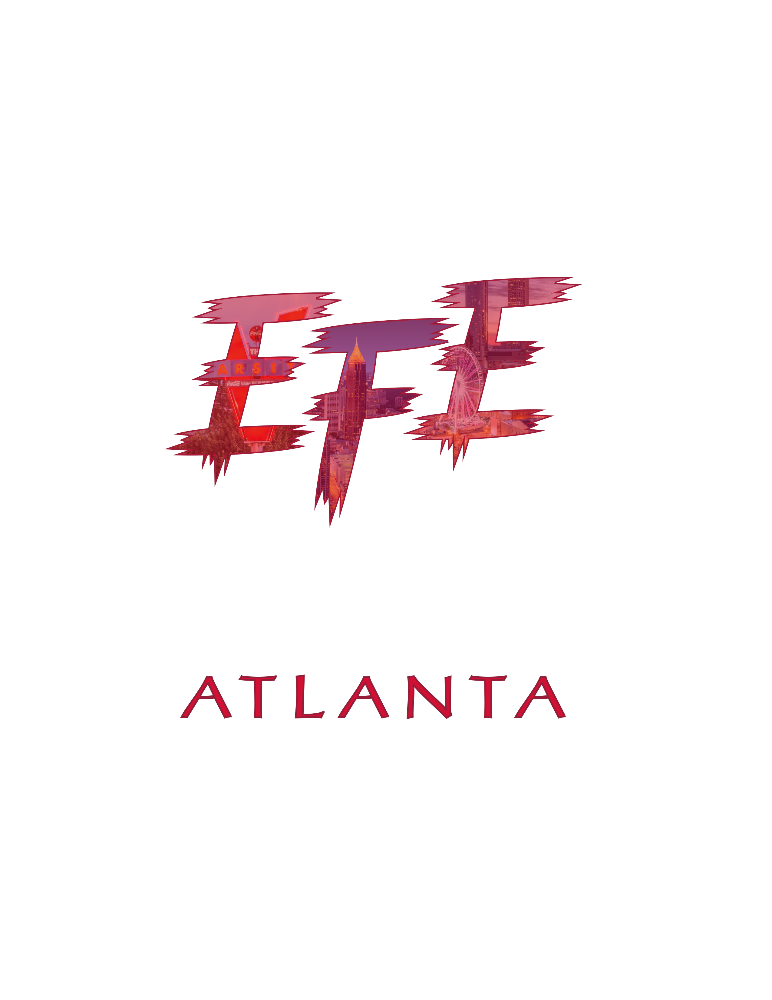
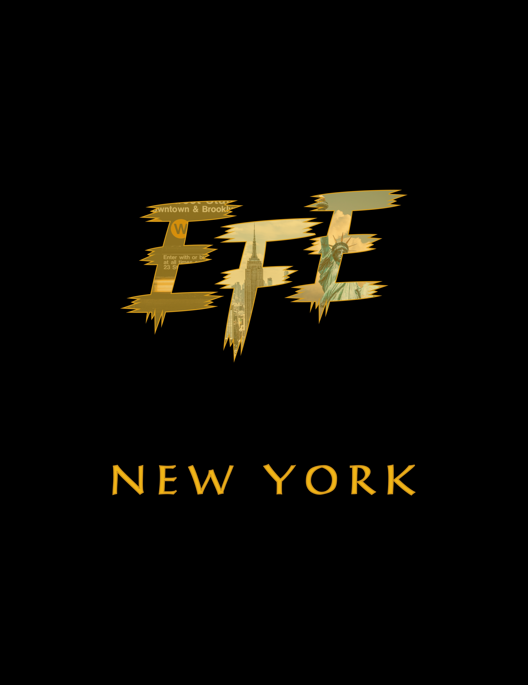
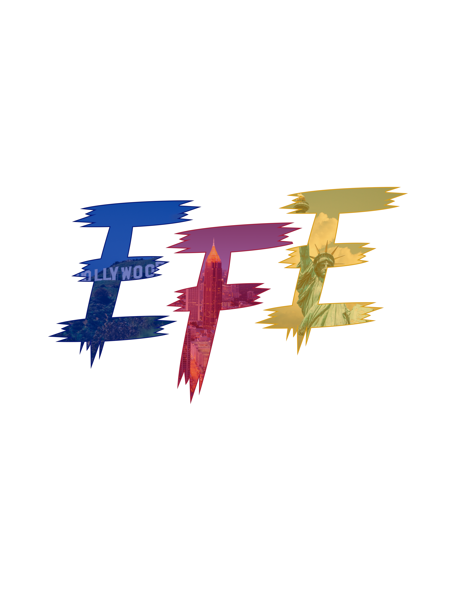

### **Highlight:**

_In this short but fun freelance project I interviewed both owners and went through a discovery phase to learn about their target audience, as well as, establish their brand identity._ 

_The owners are originally from Haiti so I wanted to establish a brand that would make them feel prideful and full of joy. I focused in on the Haitian national flag and used those exact colors to provide that experience._ 

* _This project was started and completed in 2020._
* _I used 1:1 interviews, qualitative research, and color theories_

#### **Brief:**

Epic Future Entertainment is a mass-media powerhouse that focuses on cross-brand management for the music, film, & sports industries

#### **Challenge:**

Create a brand identity that needs to establish some brand awareness -- that may also be used in various applications for both web and print use.

#### **Company Goals:**

* Establish the brand.
* Increase marketing.
* Increase reach & establish a base in large U.S cities.

#### **Pain Points:**

1. Does not have a target audience. 
2. Does not have a brand identity.
3. Needs advertisement.

#### **Solution:**

1. Design a well-polished logo that will increase cognitive awareness using color theories to produce specific emotions and gain the trust of its audience.  

