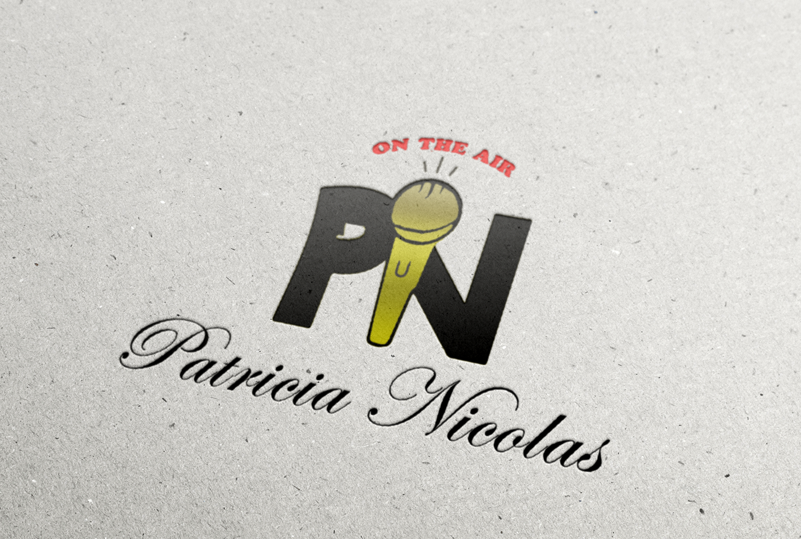
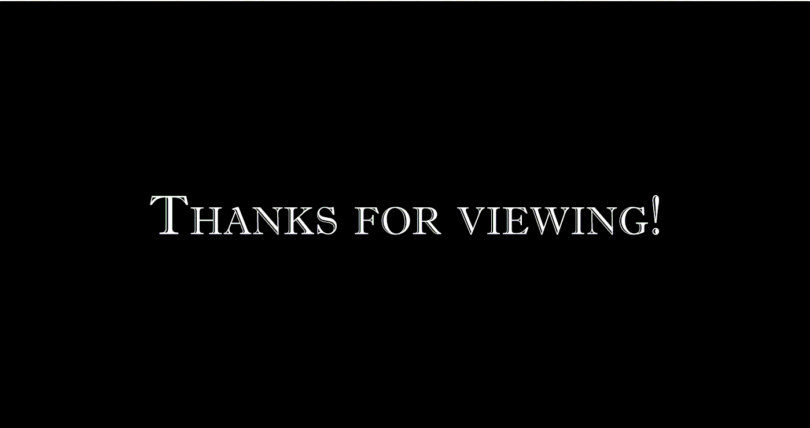

### **Highlight:**

_My very first graphic design and landing page that I created after changing majors in college to focus more on the vast world of communication._

_Though the work can be improved (and in most cases would not be included in a portfolio) I remained strong on my decision to include this project because of its sentimental value it holds on me. This was a my very first real \[paying\] client & the start of my journey of becoming a solid product designer._ 

* _This project was started and completed in 2011._
* _I used basic google searches & YouTube tutorials. (=_

#### **Brief:**

Patricia Nicolas (on the air) is a media & journalism brand that dedicates itself on providing media content from various industries, lifestyle tips, and wellness. 

#### **Challenge:**

Increase the overall brand presence so that the company may professionally establish. themselves in the media & journalism industries.

#### **Company Goals:**

* Establish self and brand awareness.
* Increase content.

#### **Pain Points:**

1. Needs a logo & advertising tools to market self. 
2. Needs a website.
3. Needs more content for audience.

#### **Solution:**

1. Create a well thought out logo design that will capture and represent the industry of choice.
2. Provide a professional landing page where visitors may sign up for newsletters, updates, and more. 

