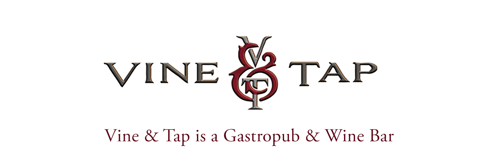
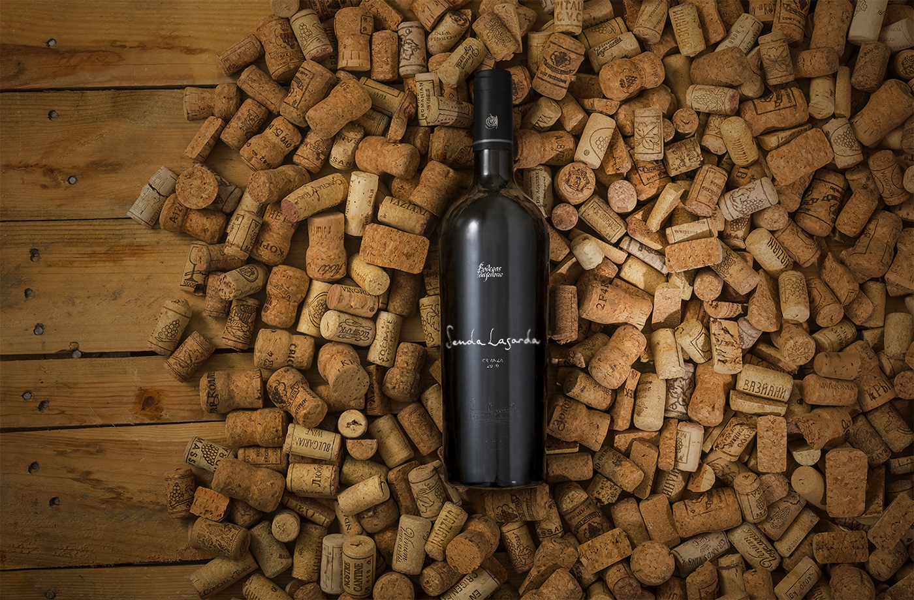
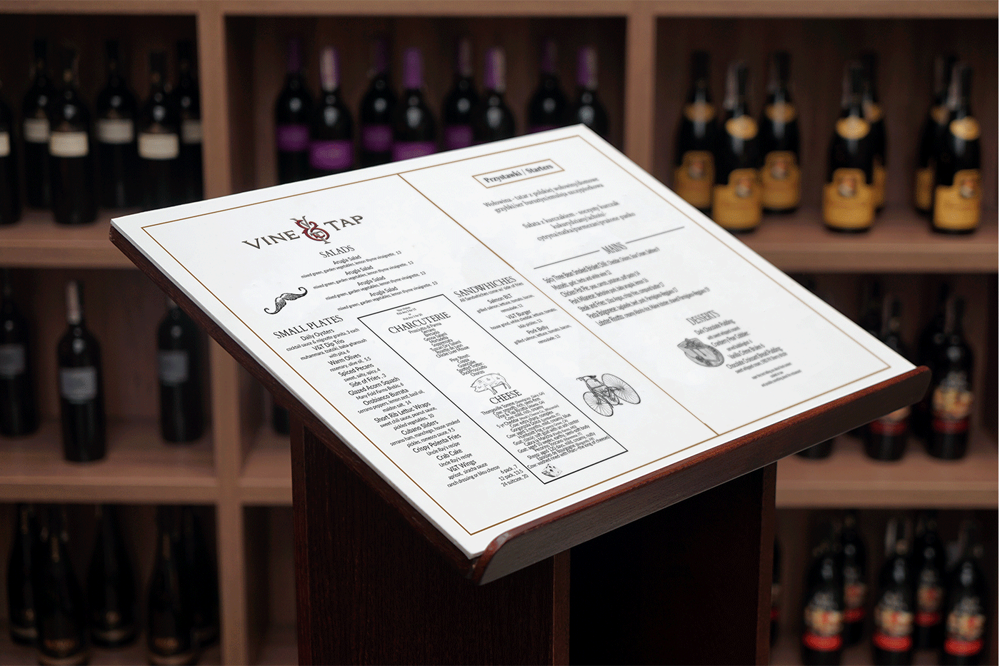
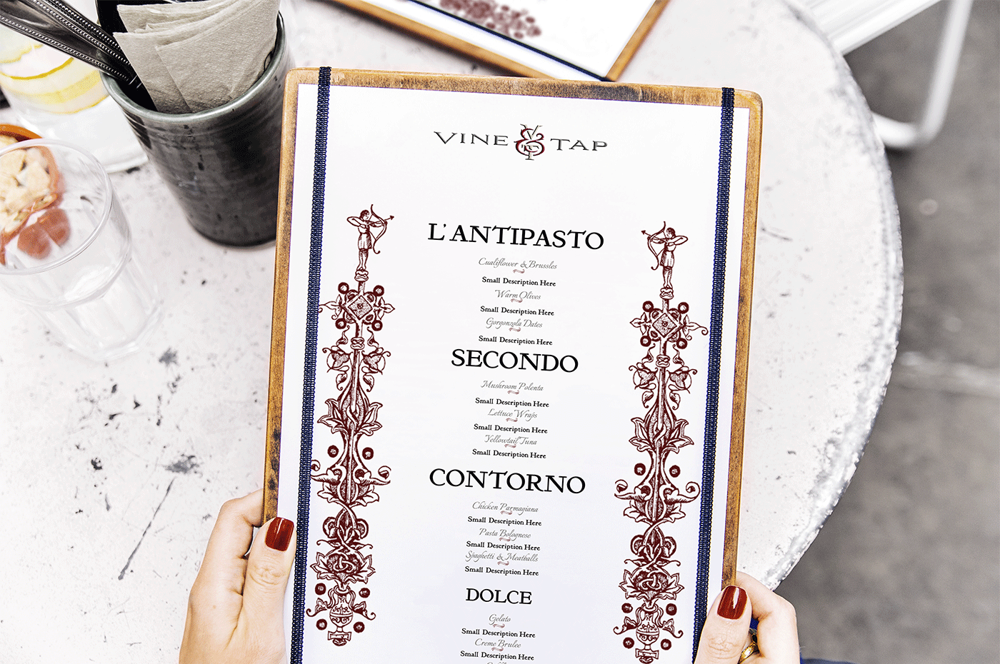
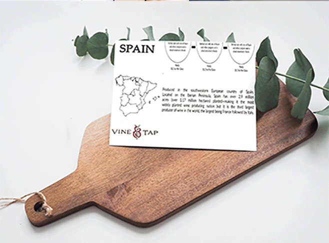
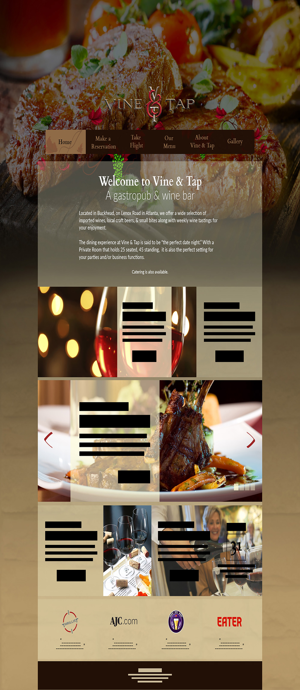

I worked on this project as a team and my role consisted of layout design and creating graphic elements to be used within the UI Design.

* This project was started and completed in 2013. I included this project in my portfolio, not to be seen as my best work but to show my progression as a designer over the years.

 

